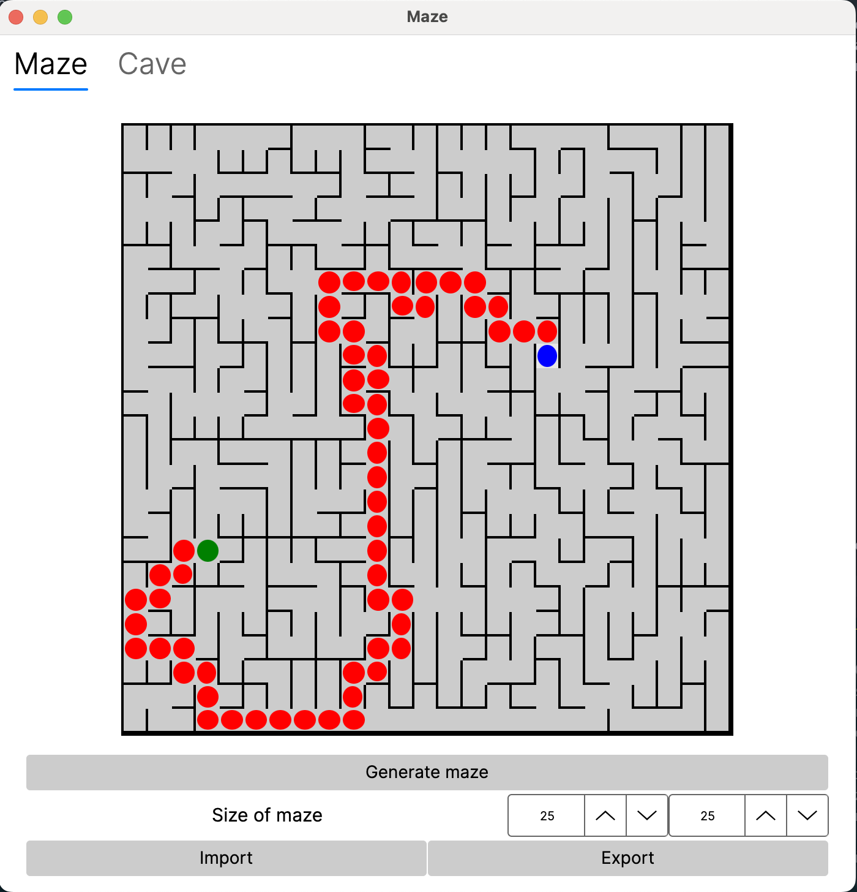
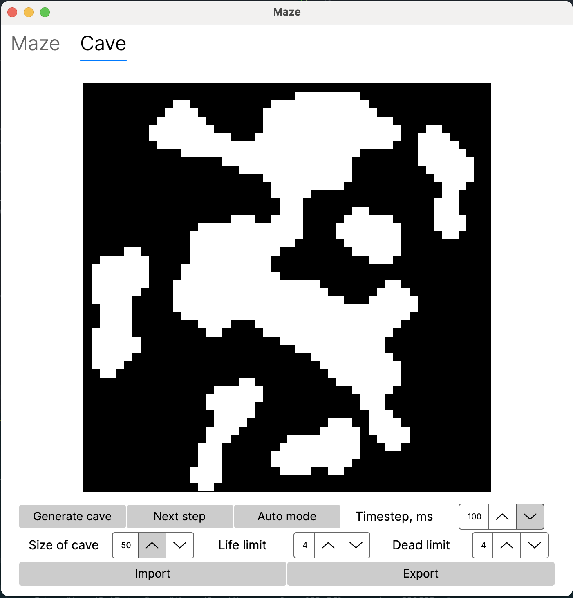

# Maze
Maze - desktop и веб-приложение, которое генерирует и отрисовывает идеальные лабиринты.
В desktop версии есть возможность генерировать пещеры с помощью клеточных автоматов

* Идеальным считается лабиринт, в котором из каждой точки можно попасть в любую другую точку ровно одним способом. Идеальный лабиринт генерируется с помощью алгоритма Эллера.

- Программа разработана на языке C#.
- Код программы находится в папке src/Maze.
- В программе реализован графический пользовательский интерфейс на базе AvaloniaUI и Vue.js
- Можно собрать программу с помощью Makefile со стандартным набором целей для GNU-программ: all, install, uninstall, clean, dvi, dist, tests.
- В программе можно загрузить лабиринт из файла и сохранить лабиринт в файл. 
- Максимальный размер лабиринта — 50 х 50.
- Обеспечено полное покрытие unit-тестами модуля генерации идеального лабиринта.
- Пользователем вводится только размерность лабиринта: количество строк и столбцов.

Пользовательский интерфейс

Есть возможность показать решение _любого_ лабиринта, который сейчас изображен на экране, нужно указать начальную и конечную точки с помощью левой и правой кнопки мыши.

Генерация пещер с [использованием клеточного автомата](#генерация-с-использованием-клеточного-автомата):
- Пользователем выбирается файл, в котором описана пещера по описанному [выше](#описание-пещер) формату.
- Максимальный размер пещеры — 50 х 50.
- Пользователем задаются пределы «рождения» и «смерти» клетки, а также шанс на начальную инициализацию клетки.
- Пределы «рождения» и «смерти» могут иметь значения от 0 до 7.
- Клетки за границей пещеры считаются живыми.
- Предусмотрен пошаговый режим отрисовки результатов работы алгоритма в двух вариантах:
  - При нажатии на кнопку следующего шага отрисовывается очередная итерация работы алгоритма;
  - При нажатии на кнопку автоматической работы запускается отрисовка итераций работы алгоритма с частотой 1 шаг в `N` миллисекунд, где число миллисекунд `N` задаётся через специальное поле в пользовательском интерфейсе.
- Обеспечено полное покрытие unit-тестами модуля генерации пещер.

Пользовательский интерфейс

Веб-версия пользовательского интерфейса выполнена в формате SPA с использованием Vue.js. Веб-интерфейс удовлетворяen всем базовым функциональным требованиям для построения и решения лабиринтов.
