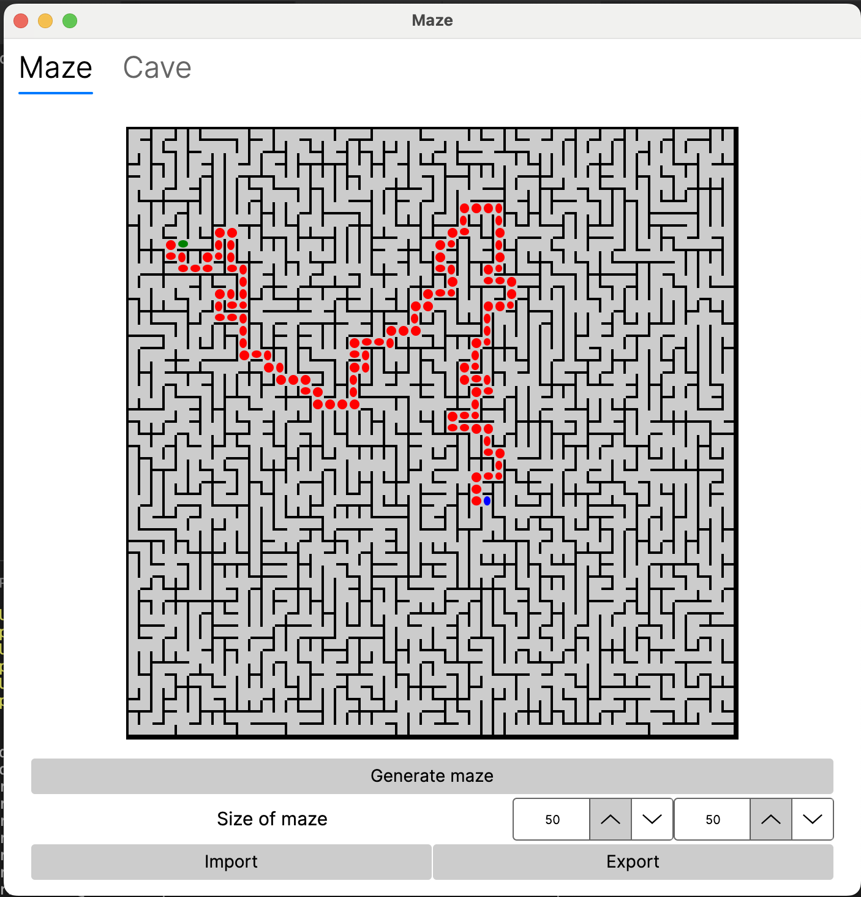
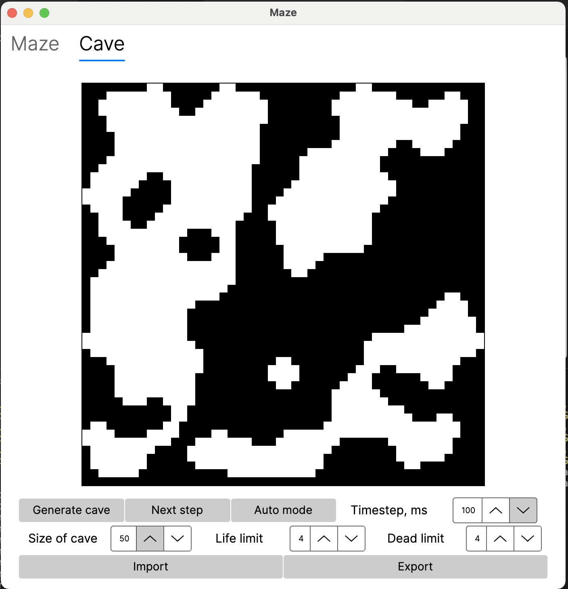
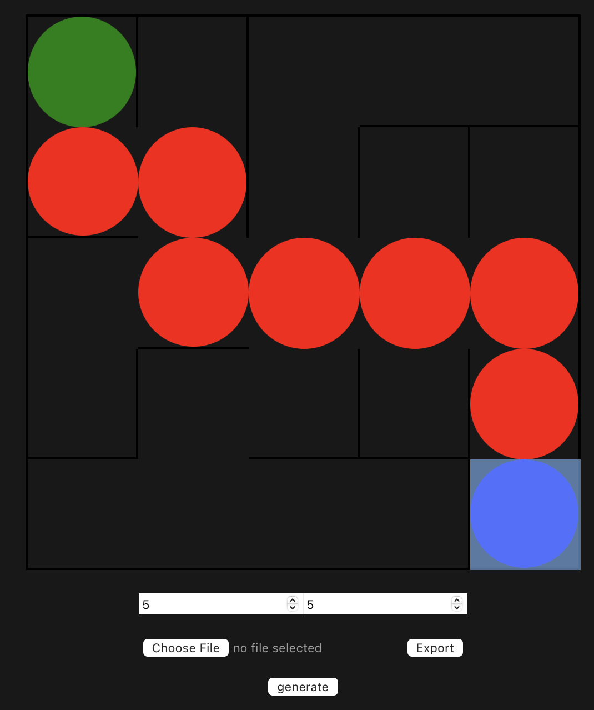
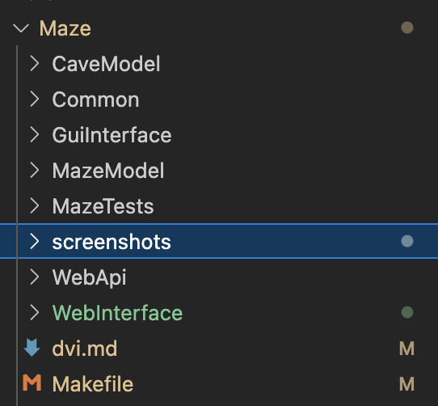

`Maze` это приложение, написанное на языке С# для генерации правильных лабиринтов, а также пещер.

## Установка
Для установки в директорию `src` перейдите в папку `src` и вызовите команду `make install`.
```bash
cd src
make install
```

В папке `src` появится приложение `Maze`, для запуска через командную строку вызовите команду `./Maze`

```bash
./Maze
```

Для формирования файлов без установки перейдите в папку `src` и вызовите команду `make build`.
```bash
make build
```

Для установки в произвольную директорию отредактируйте переменную `INSTALLDIR` в `Makefile` и вызовите команду `make install`.

Для запуска тестов в папке `src` вызовите команду `make tests`.
```bash
make tests
```

Для удаления программы в папке `src` вызовите команду `make uninstall`. Удаление программы будет производиться из каталога `INSTALLDIR`.
```bash
make uninstall
```

Для корректной сборки на компьютере должен быть установлен пакет `dotnet` для десктопной версии и `node` для web интерфейса. Перед запуском web интерфейса необходимо в папке `WebApi` выполнить команду `dotnet run`, а в папке `WebInterface` добавить файл `.env` в котором указать значение переменной `VITE_API_URI=http://127.0.0.1:5078`

После запуска тестов можно удалить временные файлы, в том числе папку с билдом, командой `make clean`
```bash
make clean
```
## Интерфейс



Приложение состоит из одного окна, в окне есть две вкладки `Maze` и `Cave`. Под окном для просмотра расположены кнопки для импорта и экспорта сгенерированных файлов.

Во вкладке `Maze` после генерации лабиринта можно указать левой клавишей мыши на начало пути, правой клавишей мыши на конец. Отобразится путь от начала до конца.

Во вкладке `Cave` после генерации пещеры можно выбрать правила генерации, меняя которые можно добиться разных пещер. Кнопка `Next step` позволяет перейти к следующему шагу генерации, кнопка `Auto mode` позваляет с некоторой задержкой выполнять команду `Next step`. Попробуйте, вам понравится!

## Web интерфейс


## Структура проекта

Проект реализован с использованием паттерна проектирования `MVVM`. Gui для desktop написан с помощью Avalonia, Web интерфейс написан на `Vue.js`. Общение `js` с моделью организовано с помощью `API` на `ASP NET Core`.

Все исходные файлы проекта находятся в папке `src/Maze`. Её содержимое:
 
* `CaveModel` - модель пещеры;
* `Common` - реализация генератора числовых последовательностей для пещер и лабиринтов;
* `GuiInterface` - реализация графического интерфейса на Avalonia;
* `MazeModel` - модель лабиринта;
* `MazeTests` - тесты для модели Maze и Cave;
* `screenshots` - скриншоты данного README;
* `WebApi` - реализация API;
* `WebInterface` - реализация фронтенда на Vue;
* `Makefile` - главный мейкфайл всего проекта, позволяет запускать цели `all, install, uninstall, clean, dvi, dist, tests`.

## Лицензия

[MIT](https://choosealicense.com/licenses/mit/)